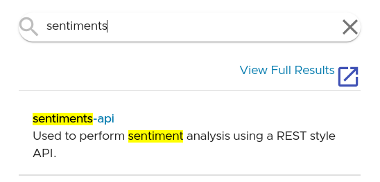
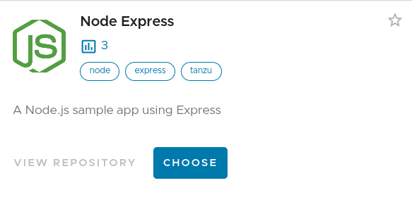

# Getting Started With VMware® Tanzu Developer Portal™

The VMware® Tanzu Developer Portal™ provides your teams with a one place where they can create, document, observe, and manage the enterprise applications they care for. Here are some quick tips to get you started with the VMware® Tanzu Developer Portal™.

## Navigating Around The UI

Over on the left you'll find a vertical side panel of icons where you can navigate around the different features of the VMware® Tanzu Developer Portal™. This panel can be expanded and contracted by clicking on the chevrons at the top.  

<figure markdown>
  { width="250" }
  <figcaption>The main menu bar.</figcaption>
</figure>

!!! info "The Navigation Panel's Menu Options"
    **Search** :mag: is where you can enter queries and search for items.

    **Home** :house: is where you'll find the software catalog.

    **Docs** :page_facing_up: contains links to all the technical documentation (TechDocs) registered with the portal.

    **Create** :heavy_plus_sign: provides multiple application accelerators (code templates) for new projects.

    **APIs** details the application programming interfaces registered with the portal.

    **Supply Chains** :link: are how platforms can deliver code securely to production. They include steps to build and test your code for known vulnerabilities, and take care of details such as deployment.[^1]

    **Security Analysis** :shield: is a dashboard where and vulnerabilities discovered in your software by the supply chain can be assessed, explored, and managed.[^1]

    **Settings** :gear: lets you customize your portal experience with settings for "Dark Mode" etc.

[^1]: Included as part of VMware® Tanzu Application Platform™ and available in VMware® Tanzu Developer Portal™ for evaluation purposes.

Read on for more information about each menu.

???+ tip "**Search – Find What You Need**"
    The VMware® Tanzu Developer Portal™ includes a system wide search facility that can help you find information stored within the system. Your technical documentation, APIs, software catalog entries, application accelerators, and more are indexed by the system.

    <figure markdown>
        
        <figcaption>An example of a search for items that relate to the to the search term "sentiments</figcaption>
    </figure>

??? tip "**Home – Discover Your Software Catalog**"

    The VMware® Tanzu Developer Portal™'s software catalog (labelled as 'Home' in the navigation panel) offers deep contextual awareness of what components are available, the APIs and documentation for them, and the critical details of who owns each piece.

    <figure markdown>
        
        <figcaption>The software catalog can list systems, components, users, and more.</figcaption>
    </figure>

    You can filter the catalog by category (Components, APIs, Systems, Users, etc.) or by owner, lifecycle, tags, etc.

    <figure markdown>
        { height="200" }
        <figcaption>Using the category filter can help you focus on only the resources you're looking for.</figcaption>
    </figure>

??? tip "**Docs – Browse Your Technical Documentation**"

    Applications (components, systems, etc.) can have register their technical documentation hosted by the portal so that it's easy to find and share amongst all your teams. These documents are searchable, written in markdown, and can live alongside your code (if that's your preferred location).

    <figure markdown>
        
        <figcaption>TechDocs help you share rich documentation with others in your organisation.</figcaption>
    </figure>

??? tip "**Create – Start A New Project**"

    Application Accelerators (labelled as 'Create' in the navigation) provide ready made and pre-approved coding project templates which you can customize and download. These templates drastically shorten the time taken to begin new projects. They encourage the use of your best practices for application design and help you stay on the golden path.

    <figure markdown>
        
        <figcaption>Using a Node.JS accelerator to begin a new project.</figcaption>
    </figure>
    

    Better yet, you can create your own application accelerators and share them with other portal users. This will help you standardize on common tools, and eliminate the time you normally waste adding common libraries or configuration.

??? tip "**APIs – Know Your Application Programming Interfaces**"

    APIs available to developers can be listed, shared, and documented using common standards such as OpenAPI[^1]. APIs registered here in this way have a high degree of utility. With the API document view, you can "try out" an API before you write code to consume it. 

    [^1]: Some may know the OpenAPI specification via its previous name - "Swagger documentation."

    <figure markdown>
        
        <figcaption>Trying out an API in the API docs viewer.</figcaption>
    </figure>

??? tip "**Settings – Customize Your Experience**"

    The settings panel is where you will find access to the "light" and "dark" modes for the UI as well as other information such as your profile details (if you have a profile).

    <figure markdown>
        
        <figcaption>Use the settings panel to change your UI theme.</figcaption>
    </figure>
    
*[UI]: User Interface
*[API]: Application Programming Interface
*[APIs]: Application Programming Interfaces